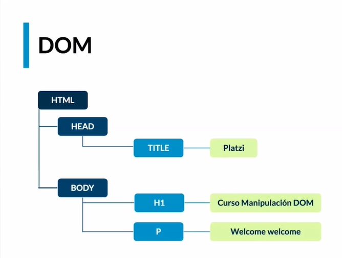

# Critical Rendering Path (Ruta de acceso de representación crítica)

Es un proceso que los navegadores realizan para que nuestro script ( HTML, CSS, JavaScript) se convierta en pixeles en la pantalla.

Esto se puede dividir en varias fases pero solo veremos cierta parte del proceso en donde el navegador crea 2 árboles:

**DOM** (Document Object Model) : corresponde al árbol HTML.

Es un árbol de nodos el cual representa cada una de las etiquetas HTML.

- Es una representación del HTML.
- Estructura en forma de árbol de nodos
- Es un modelo que puede ser modificado.

**CSSOM** (CSS Object Model) : corresponde al árbol CSS.