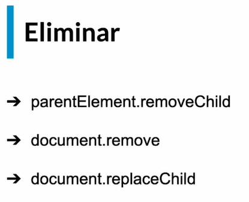
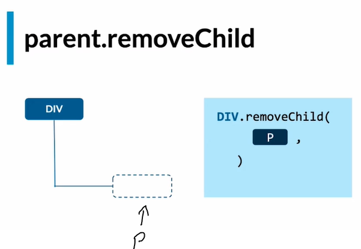
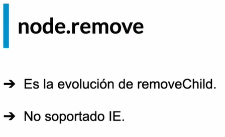
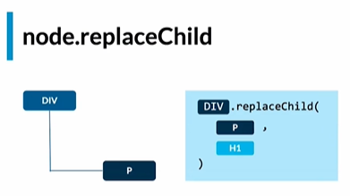

# Eliminar nodos



## Eliminar con "removeChild"

parentElement.removeChild() -> Elimina un nodo hijo apartir del elemento padre.



Uso normalmente (sin especificar el padre):

```Javacript
const nodoEliminar = document.querySelector("nodo a eliminar");
nodoEliminar.parentElement.removeChild(nodoEliminar); //el "parentElement" por asi decirlo, detecta el padre del nodo que queremos eliminar.
```

Especificando el padre:

```Javascript
const nodoEliminar = document.querySelector("nodo a eliminar");
const padre = document.querySelector("padre del nodo a eliminar");
//Extra - tambien se puede selecionar al padre de la siguiente forma
//const padre = nodoEliminar.parentElement;
padre.removeChild(nodoEliminar);
```

## Evolución de "removeChild"

Con "remove" no es necesario referenciar al padre del nodo a eliminar. Simplemente colocamos el nodo que queremos eliminar con remove y listo.



"remove" por dentro va al padre y utiliza "removeChild".

Veamos un ejemplo:

```JavaScript
const nodoEliminar = document.querySelector("nodo a eliminar");
nodoEliminar.remove();
```

## Remplazar con "replaceChild"



Remplaza un nodo (elimina y agrega otro).

Veamos un ejemplo:

```JavaScript
const padre = document.querySelector("padre del nodo a remplazar");
const toReplace = document.querySelector("nodo a remplazar"); //que sea un "h1", por ejemplo.
const nodoCreate = document.createElement("creas el nodo que quieras"); //creamos un nodo para remplazar (en este caso que sea un "h2")
nodoCreate.textContent = "From checkout"; //agregamos texto al "h2"
padre.replaceChild(nodoCreate,toReplace); //indicamos el padre, en donde se hara el remplazo, luego el nodo que será agregado y por último el nodo que será remplazado.
```