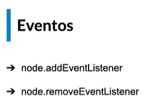
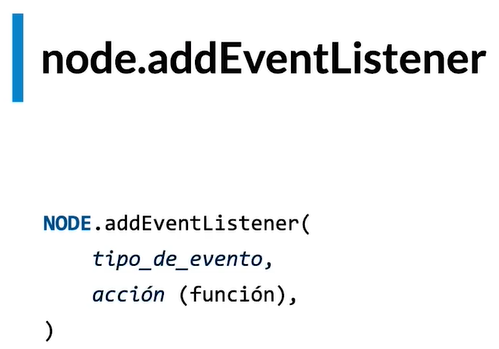
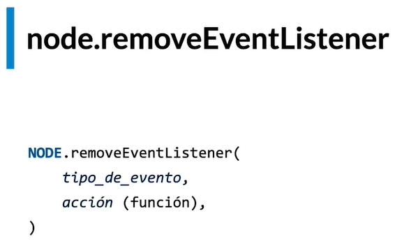

# Eventos



### Evento "addEventListener"

Este método no permite dar una acción.



Veamos un ejemplo:

```JavaScript
const input = document.getElementById('nombre del nodo');
input.addEventListener('click',()=>{}); // el primer parametro que recibe es el evento 
//(en este caso click) y el segundo es la acción que se realizará al ejecutar el evento. 
//El segundo parametro puede ser una función declarativa, 
//funcion flecha o funcion expresiva.
```

### Evento "removeEventListener"

Este método nos permite eliminar un evento.



Veamos un ejemplo:

```JavaScript
const email = document.getElementById('nodo agregar evento');
const accion = () => console.log('accion1');
const accion2 = () => console.log('accion2');

email.addEventListener('click',accion);
email.addEventListener('click',accion2);

email.removeEventListener('click',accion); // en el primer parametro se debe colocar en que 
//evento sucede y en el segundo se coloca la funcion que se debe eliminar.
```

**Nota: **para eliminar una acción se debe especificar el nombre de la función. Si utilizamos una función anónima nunca la podremos eliminar.