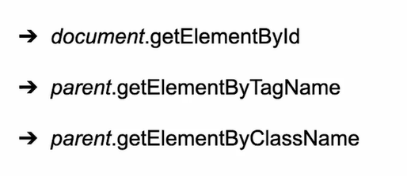
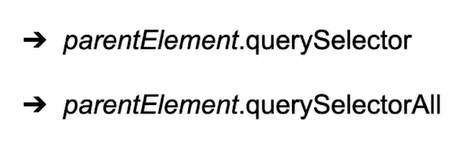

# **Leer nodos**

Las formas de obtener los nodos mas usadas:

Tenemos los mas recomendados:

"querySelector" es un selector de un solo elemento. Solo trae el primer elemento que encuentre.

Funciona cualquier selector que funcionaria en css.

Ejemplos:

document.querySelector('#addres')

document.querySelector('input')

document.querySelector('.form-control')

Usamos "querySelectorAll" cuando queramos todos los elementos de ese selector.

Ejemplos:

document.querySelectorAll('input')

document.querySelectorAll('.mb-4')