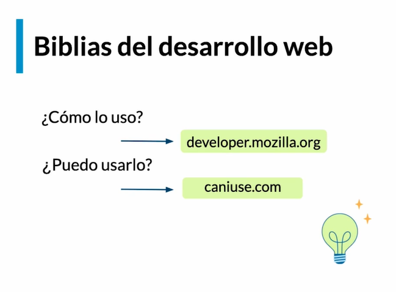

# **Web APIs**

### **¿Qué es una API?**

Es un puente que permite comunicar un software con otro.

Una Web API permite comunicar el DOM con Javascript.

De esta manera podemos manipular el DOM a nuestro antojo.

Podemos ver estas páginas en el desarrollo web.

